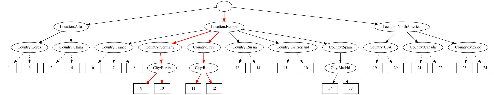

# NetMap

[](https://travis-ci.org/nspcc-dev/netmap)
[](https://codecov.io/gh/nspcc-dev/netmap)
[](https://goreportcard.com/report/github.com/epicchainlabs/netmap/netmap)
[](https://github.com/epicchainlabs/netmap/netmap)

## Demo

[](https://asciinema.org/a/d5DW80hzdN1fOBn8azBYZIkan)

**Select 1 Country, filter Location NE Asia**


**Select 2 Cities, filter Location EQ Europe**


## Description

The **NetMap** tool for EpicChain is an advanced REPL (Read-Eval-Print Loop) interface designed for interactive management of geographic data within the EpicChain ecosystem. It provides users with a powerful means to interact with and manipulate a geographical database, applying placement rules to efficiently manage and query location-based information. 

NetMap integrates seamlessly with EpicChain’s decentralized storage solutions, leveraging CRUSH (Controlled Replication Under Scalable Hashing) enhancements with advanced FILTER capabilities to optimize data distribution and accessibility. The tool is instrumental in managing and analyzing geographic and placement data, allowing for intricate data operations and visualizations.

The **NetMap** tool is equipped with a suite of commands that facilitate various operations:

### Commands

To access detailed help for any command, simply type `command help` in the REPL.

#### help
`help`

Provides a comprehensive list of available commands and their descriptions. This command is your starting point for understanding how to navigate and utilize NetMap effectively.

#### exit
`exit`

Exits the program, closing the REPL session. Ensure all necessary operations are completed before using this command to avoid loss of unsaved data.

#### load
`load <filename>`

Loads a NetMap configuration from the specified file. This allows you to import previously saved maps or configurations into the current session for further manipulation or analysis.

#### save
`save <filename>`

Saves the current NetMap configuration to a specified file. Use this command to preserve your changes or create backups of your NetMap data.

#### clear
`clear`

Clears the current NetMap data, resetting the state of the tool. This command is useful for starting fresh or removing temporary data that is no longer needed.

#### select
`select <number> <key>`

Allows you to select nodes based on specific criteria. This is essential for filtering and managing data based on location, country, or other attributes.

Example:
```
>>> add 1 /Location:Europe/Country:Germany
>>> add 2 /Location:Europe/Country:Austria
>>> add 3 /Location:Asia/Country:Korea
>>> add 4 /Location:Asia/Country:Japan
>>> select 1 Location
>>> select 2 Country
```

#### filter
`filter <key> <operation> <value>`

Applies a filter to the selected nodes based on the specified key, operation, and value. Operations can be EQ (equal), NE (not equal), LT (less than), LE (less than or equal), GT (greater than), and GE (greater than or equal). This command is useful for refining your data selection based on specific criteria.

Example:
```
>>> add 1 /Location:Europe/Country:Germany
>>> add 2 /Location:Europe/Country:Austria
>>> filter Country NE Austria
```

#### get-selection
`get-selection`

Retrieves nodes from the current selection. This command provides a list of nodes that match the selection and filter criteria applied previously.

Example:
```
>>> load /examples/map2
>>> select 1 Country
>>> filter Location NE Asia
>>> get-selection
[13 14]
```

#### clear-selection
`clear-selection`

Clears the current selection, removing any applied filters or selected nodes. This is useful for resetting the state of your selections and starting new queries.

#### dump-selection
`dump-selection <filename>`

Exports the current NetMap selection to a graphical format and saves it to the specified file. If using Docker, ensure the `/pics` directory is mounted as `temp` on the host to facilitate file access and storage.

## Additional Notes

- **NetMap Integration**: NetMap’s capabilities are designed to integrate with EpicChain’s advanced data management and storage systems, providing a seamless experience for geographic and placement data operations.
- **CRUSH Enhancements**: The tool leverages enhanced CRUSH algorithms to improve data distribution and retrieval efficiency, ensuring optimal performance in large-scale deployments.

The **NetMap** tool is an essential utility for managing geographic and placement data within the EpicChain ecosystem. By providing an interactive and powerful REPL interface, it enables users to efficiently handle complex data operations and ensure optimal placement and distribution of resources.
